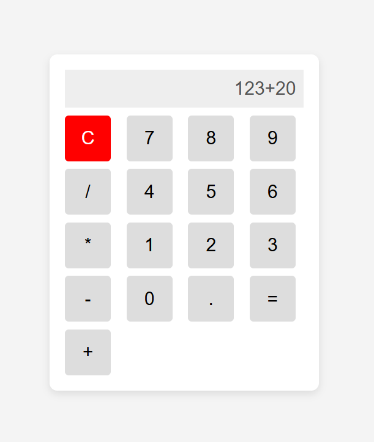

# 🧮 Calculator Project

A simple, stylish, and fully functional **Calculator Web App** built using **HTML, CSS, and JavaScript**.  
This project is beginner-friendly and a great way to practice the basics of frontend development. 🚀

---

## 📌 Features

✅ Perform basic arithmetic operations: **Addition, Subtraction, Multiplication, Division**  
✅ User-friendly and responsive UI  
✅ Clear button to reset the display  
✅ Error handling for invalid inputs  
✅ Beginner-friendly code with comments  
✅ Extendable with new features like **Dark Mode, Keyboard Support, and Calculation History**  

---

## 🖼️ Demo Screenshot

---

## 🚀 Technologies Used

- **HTML5** – Structure of the calculator  
- **CSS3** – Styling and layout (Grid system used for buttons)  
- **JavaScript (ES6)** – Functionality and logic for calculations  
